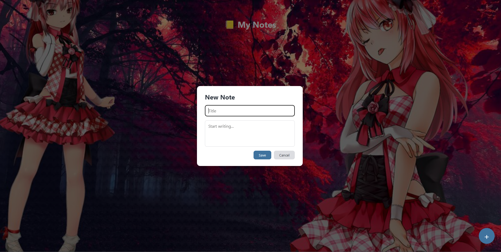
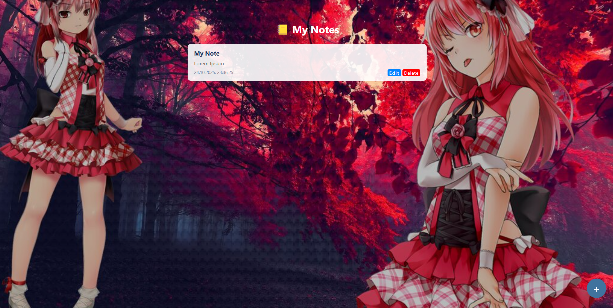

# 📝 **NoteFlow — минималистичный менеджер заметок**




---

## 🚀 **Описание проекта**
**NoteFlow** — это лёгкое веб-приложение для создания, редактирования и удаления заметок **в реальном времени**.  
Архитектура построена по принципу **frontend + backend**, где фронт — это **чистый JavaScript**, а бэкенд — **Go**.

---

### 💡 **Что демонстрирует проект**
- 🔄 Динамическое управление DOM без фреймворков  
- 🌐 Асинхронные запросы через `fetch()`  
- 🧱 Безопасное REST API-взаимодействие клиента и сервера  
- 🪄 Модальное управление UI (создание, редактирование, удаление)  

---

## 🧩 **Технологический стек**

| Компонент | Технология |
|------------|-------------|
| 🎨 **Frontend** | HTML5, CSS3, JavaScript (ES6 Modules) |
| ⚙️ **Backend** | Go |
| 💾 **Хранение данных** | JSON |
| 🧠 **Инфраструктура** | Fetch API, sessionStorage |

---

## ⚙️ **Функциональность**
✅ Создание новых заметок через модальное окно  
✅ Редактирование существующих заметок в отдельной вкладке  
✅ Удаление заметок с подтверждением  
✅ Мгновенное обновление интерфейса без перезагрузки  
✅ Безопасное хранение данных  

---

## 🧭 **Архитектура проекта**

### **Frontend**
- `UI.js` — управление интерфейсом, модальными окнами и обновлением DOM  
- `backend.js` — API-запросы (`sendNote()`, `deleteNote()`, `editNote()`) через `fetch()`  

### **Backend (Go)**
REST API эндпоинты:
- `POST /api/add-note` — добавление заметки  
- `PUT /api/edit-note` — редактирование  
- `DELETE /api/delete-note` — удаление  

**Ответ сервера (пример):**
```json
{ "status": "ok", "note_id": 123 }
